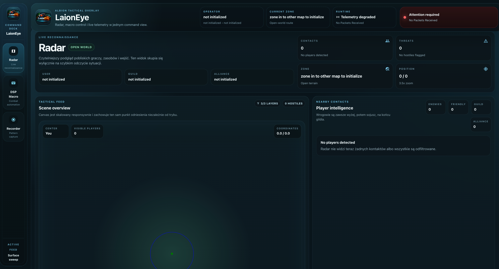
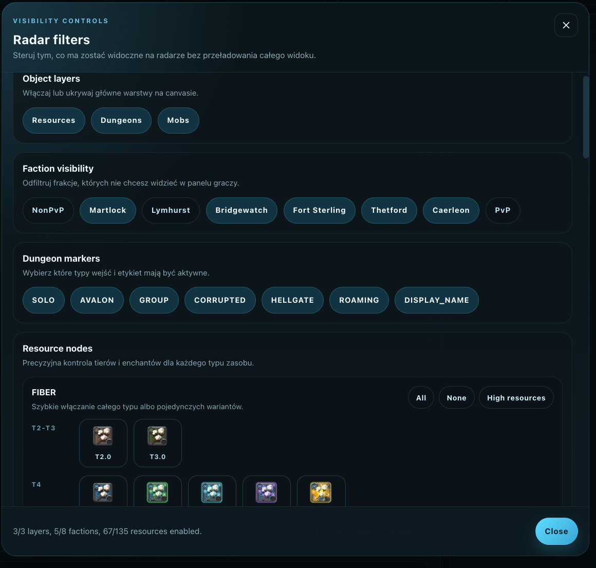
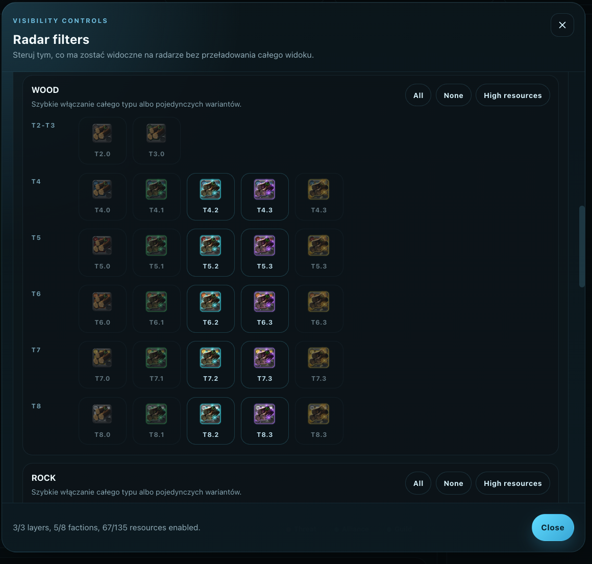
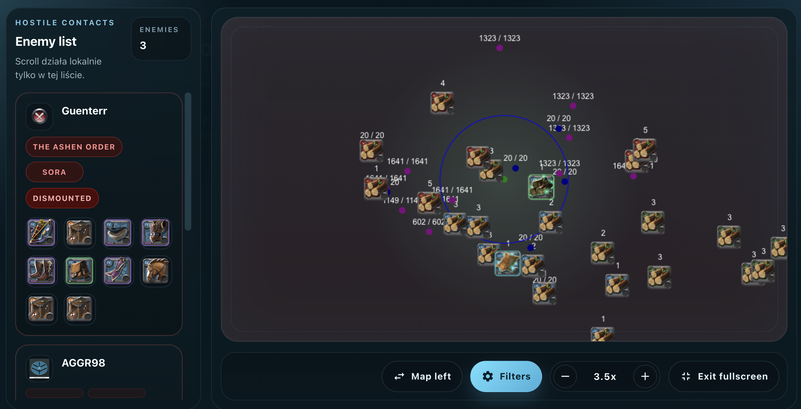
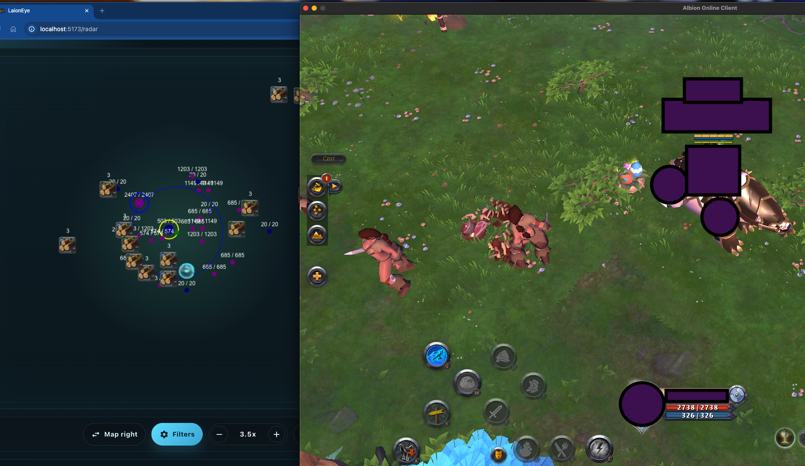
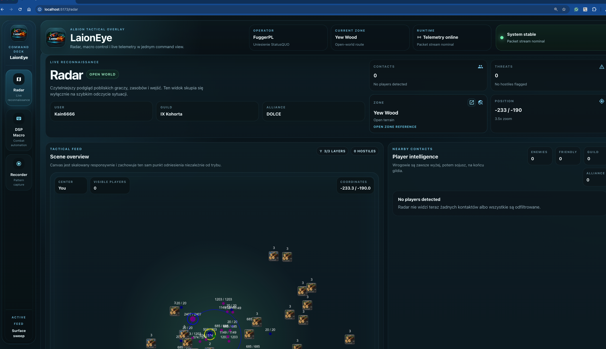
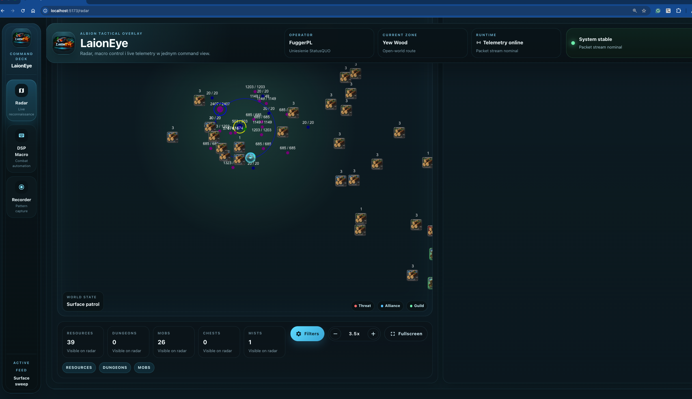
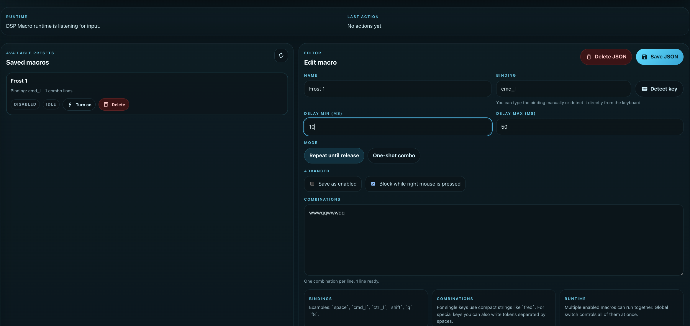
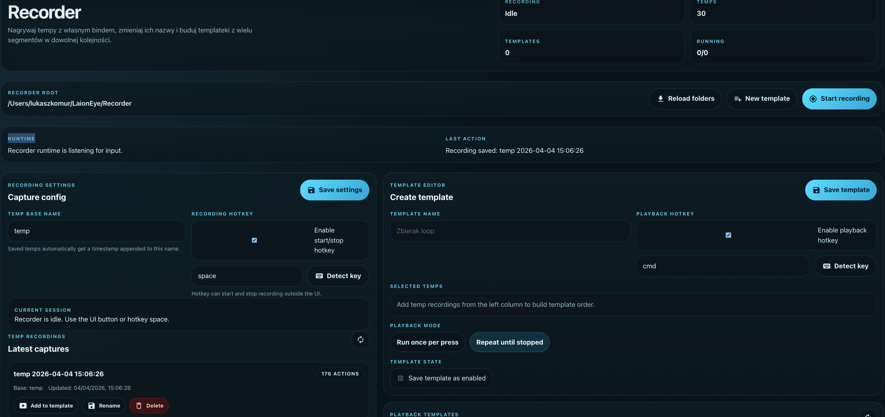
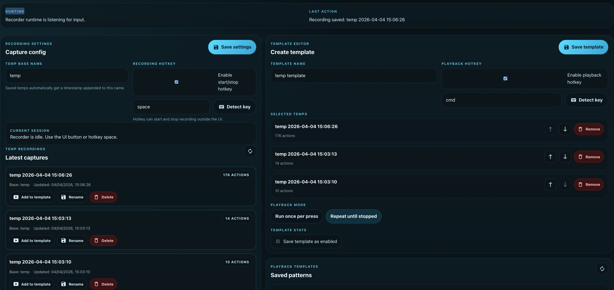

# LaionEye

<p align="center">
  <a href="https://laionfromnight.github.io/interactive-cv/#contact">
    
  </a>
  <a href="https://pypi.org/project/albibong/">
    
  </a>
  <a href="https://pypi.org/project/albibong/">
    
  </a>
</p>

<p align="center">
  
</p>

## Overview

<p align="center">
  LaionEye is a desktop and browser-based tactical overlay for Albion Online.
</p>

## Radar Features

| Initial Radar | Filter Presets | Advanced Filters |
|---|---|---|
|  |  |  |

## Fullscreen & Map Views

| Fullscreen Radar | In-Game Overlay | Map View 1 | Map View 2 |
|---|---|---|---|
|  |  |  |  |

## Macro Features

| DPS Macro | Recorder | Recorder Details |
|---|---|---|
|  |  |  |

Current modules:

- `Radar`
- `DSP Macro`
- `Recorder`

The legacy documentation was kept as [STARE-README.MD](./STARE-README.MD).

## Requirements

- Python `3.10+`
- Node.js `18+`
- npm

Extra platform requirements:

- macOS: Terminal or iTerm must be allowed in `Privacy & Security -> Accessibility`
- Windows: install `Npcap` so Scapy can sniff packets

## Project Layout

- backend package: `src/laioneye`
- frontend source: `gui`
- built frontend served by backend: `src/laioneye/gui_dist`
- local app data:
  - macOS/Linux: `~/LaionEye`
  - Windows: `%USERPROFILE%\\LaionEye`

## macOS Install From Scratch

### 1. Install system dependencies

Install Python and Node.js first. One common setup is:

```bash
brew install python@3.12 node
```

### 2. Clone the project

```bash
git clone <YOUR_REPOSITORY_URL> LaionEye
cd LaionEye
```

### 3. Create and activate virtual environment

```bash
python3 -m venv .venv
source .venv/bin/activate
python -m pip install --upgrade pip
```

### 4. Install backend dependencies

```bash
python -m pip install -r src/laioneye/requirements.txt
python -m pip install -e .
```

### 5. Install frontend dependencies

```bash
cd gui
npm install
cd ..
```

### 6. Build the frontend for the desktop/webview version

```bash
cd gui
npm run build
cd ..
```

### 7. Run LaionEye

Desktop/webview launch:

```bash
sudo ./.venv/bin/laioneye
```

Development mode in two terminals:

Terminal 1:

```bash
cd /Users/<YOUR_USER>/path/to/LaionEye/src
sudo ../.venv/bin/python -m laioneye
```

Terminal 2:

```bash
cd /Users/<YOUR_USER>/path/to/LaionEye/gui
npm run dev
```

Then open:

```text
http://localhost:5173
```

### 8. macOS permissions

If `DSP Macro` or `Recorder` do not react to keys or mouse:

1. Open `System Settings -> Privacy & Security -> Accessibility`
2. Add and enable your Terminal or iTerm
3. If needed, add the interpreter from `.venv/bin/python`
4. Restart the terminal after changing permissions

If packet sniffing fails with permission errors, start LaionEye with `sudo`.

## Windows Install From Scratch

### 1. Install required software

Install:

- Python `3.10+`
- Node.js `18+`
- `Npcap` from `https://npcap.com/#download`

During Python install, enable `Add python to PATH`.

### 2. Clone the project

```powershell
git clone <YOUR_REPOSITORY_URL> LaionEye
cd LaionEye
```

### 3. Create virtual environment

```powershell
py -m venv .venv
.venv\Scripts\activate
python -m pip install --upgrade pip
```

### 4. Install backend dependencies

```powershell
python -m pip install -r src\laioneye\requirements.txt
python -m pip install -e .
```

### 5. Install frontend dependencies

```powershell
cd gui
npm install
cd ..
```

### 6. Build the frontend for desktop/webview

```powershell
cd gui
npm run build
cd ..
```

### 7. Run LaionEye

Desktop/webview launch:

```powershell
.venv\Scripts\laioneye
```

Development mode in two terminals:

Terminal 1:

```powershell
cd src
..\.venv\Scripts\python.exe -m laioneye
```

Terminal 2:

```powershell
cd gui
npm run dev
```

Then open:

```text
http://localhost:5173
```

## Common Commands

Install backend dependencies again:

```bash
python -m pip install -r src/laioneye/requirements.txt
```

Rebuild frontend:

```bash
cd gui
npm run build
```

Run backend from source:

```bash
cd src
python -m laioneye
```

## Notes

- `Radar` settings are persisted locally in the browser.
- `DSP Macro` configs are stored in `~/LaionEye/DSPMacros`.
- `Recorder` data is stored in `~/LaionEye/Recorder`.
- On first start, move to another zone in Albion so the character and map state can initialize correctly.


#### Common Mac Problems

If you encounter this problem

```
scapy.error.Scapy_Exception: Permission denied: could not open /dev/bpf0. Make sure to be running Scapy as root ! (sudo)
```

Use `sudo laioneye` to start LaionEye.

#### Common Windows Problems

If you encounter this problem

```
'laioneye' is not recognized as an internal or external command, operable program or batch file.
```

Add PIP package to path by following this guide https://youtu.be/9_WyyV_66rU?si=0shXXv59MBeQBHiH


For WARNING: No libpcap provider available ! pcap won't be used
Thread sniffer started

```
WARNING: No libpcap provider available ! pcap won't be used
Thread sniffer started
Exception in thread AsyncSniffer:
Traceback (most recent call last):
Thread packet_handler started
  File "C:\Users\USER\AppData\Local\Programs\Python\Python39\lib\threading.py", line 973, in _bootstrap_inner
Thread ws_server started
    self.run()
  File "C:\Users\USER\AppData\Local\Programs\Python\Python39\lib\threading.py", line 910, in run
    self._target(*self._args, **self._kwargs)
  File "C:\Users\USER\AppData\Local\Programs\Python\Python39\lib\site-packages\scapy\sendrecv.py", line 1171, in _run
    sniff_sockets[_RL2(iface)(type=ETH_P_ALL, iface=iface,
  File "C:\Users\USER\AppData\Local\Programs\Python\Python39\lib\site-packages\scapy\arch\windows__init.py", line 1019, in init__
    raise RuntimeError(
RuntimeError: Sniffing and sending packets is not available at layer 2: winpcap is not installed. You may use conf.L3socket orconf.L3socket6 to access layer 3
```

Install (NPCAP)[https://npcap.com/#download)

## Working version
```
python3 --version
Python 3.9.6
```

```
node --version
v23.6.1
```

In case you are on windows and by mistake you will install to many version of python check it ->
```
py -3.9 --version
```

If this will works you need to install and run backend with this commands
```
py -3.9 -m albibong
py -3.9 -m pip install -r albibong/requirements.txt
```

### _"Can I use the tool with ExitLag, 1.1.1.1 or VPN?"_

No, this is not possible. If Albion is blocked in your country, I suggest to add Albion's servers to your hosts file.


## 🤝🏼 Credits

- Event and Operation Codes based on [AlbionOnline-StatisticsAnalysis](https://github.com/Triky313/AlbionOnline-StatisticsAnalysis) with modifications
- Map and Item Codes based on [ao-bin-dumps](https://github.com/ao-data/ao-bin-dumps) with modifications
- Use of [photon-packet-parser](https://github.com/santiac89/photon-packet-parser) with modifications
- Use of [deatheye](https://github.com/pxlbit228/albion-radar-deatheye-2pc/blob/master/Radar/Packets/Handlers/MoveEvent.cs)
- Based on old [Albiong](https://github.com/imjangkar/albibong)


## Updates Data Used by Radr->

The `ao-bin-dumps` directory contains the following files:
you can find the orginals on (ao-bin-dupms)[https://github.com/ao-data/ao-bin-dumps/tree/master]
```
src/albibong/resources/ao-bin-dumps-json/
├── harvestables.json  # Contains data about harvestable resources
├── mobs.json          # Contains data about mobs
```


The items maps you can generate by pulling this data (ao-bin-dupms-formatted)[https://github.com/ao-data/ao-bin-dumps/blob/master/formatted/items.txt] into myscripts/items and calling the convert.py

```
src/albibong/resources/
├── items_by_id.json  
├── items_by_unique_name.json
```


The list of event codes you can pull from (AlbionOnline-StatisticsAnalysis)[https://github.com/Triky313/AlbionOnline-StatisticsAnalysis/blob/bc4140880e25052d3359a529957a214556a06451/src/StatisticsAnalysisTool/Network/EventCodes.cs]

The list fo operationCodes (AlbionOnline-StatisticsAnalysis)[https://github.com/Triky313/AlbionOnline-StatisticsAnalysis/blob/bc4140880e25052d3359a529957a214556a06451/src/StatisticsAnalysisTool/Network/OperationCodes.cs]

Next you have to put this data into scripts myscripts/eventcodes and call convert.py or operationcodes folder

```
src/albibong/resources/
├── event_code.json 
├── EventCode.py
├── operation_code.json
├── OperationCode.py
```

The offset you can take from (albion-radar-deatheye-2pc)[https://github.com/pxlbit228/albion-radar-deatheye-2pc/blob/master/jsons/offsets.json]
```
src/albibong/resources/
├── offset.json
├── Offset.py
```